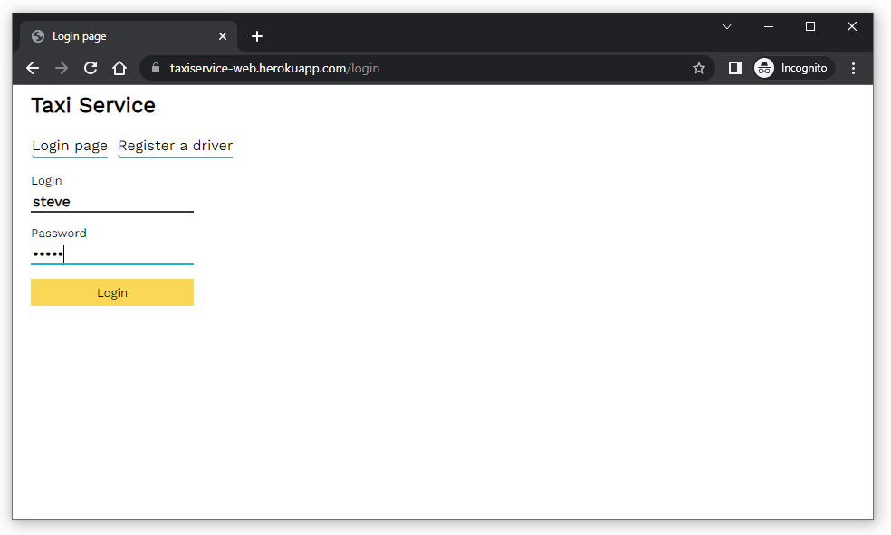
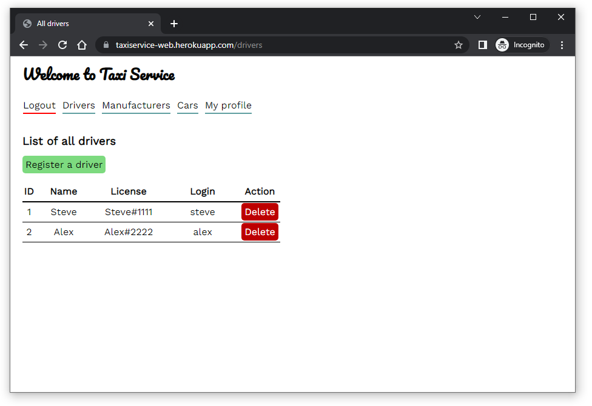
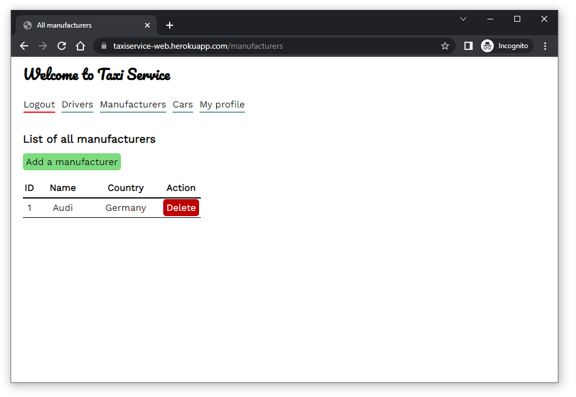
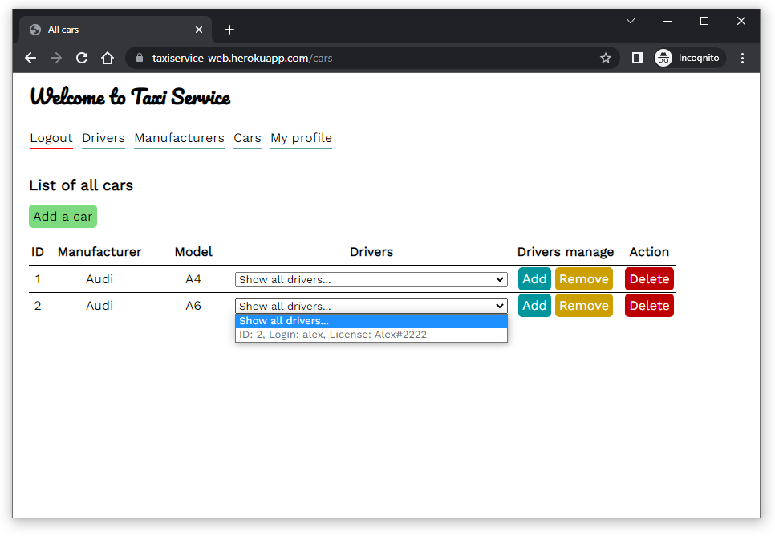
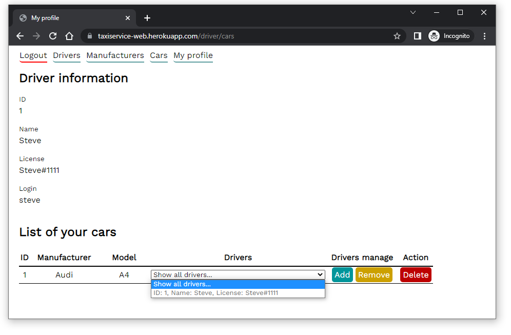
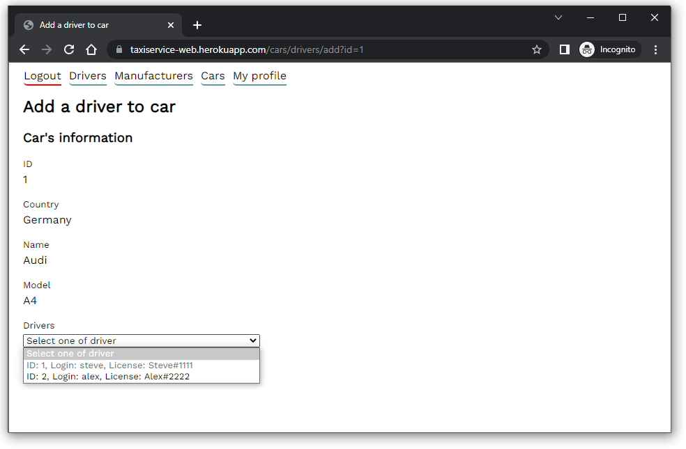
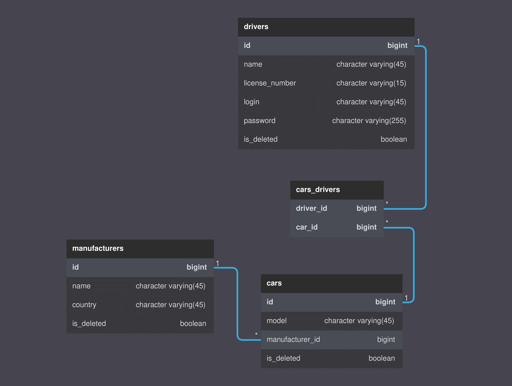
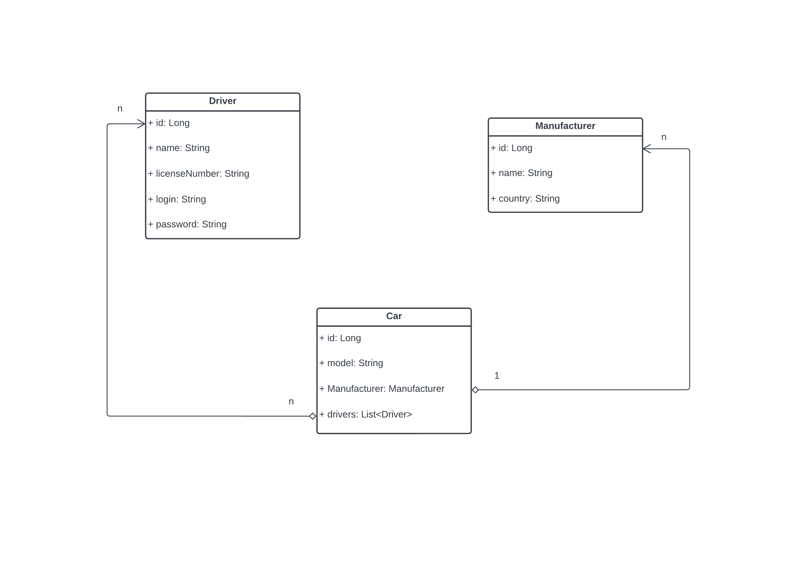

# 🚕 Taxi Service 🚕

### 👀 Overview

Taxi Service - a simple web-application that allows you to do a taxi management.

***

### 📖 Description
With this simple web-application taxi management becomes a lot easier!

**You can test this already deployed project at the following link:**

https://taxiservice-web.herokuapp.com/

The application supports:
- Authentication
- Registration
- Logout

You can easily manage _manufacturers_/_cars_/_drivers_ with these CRUD operations:
- ##### 🏭 Manufacturer
    - Add
    - Delete

- ##### 🚗 Car
    - Add
    - Delete
    - Add / Remove a driver

- ##### 😎 Driver
    - Register
    - Delete

- ##### 📄 List of all
    - Manufacturers
    - Cars
    - Drivers
- ##### 💼 Profile of the logged in driver with their cars

🙂 _PS. The application provides a user-friendly web interface that is easy to work with!_ 

***

### 🧱 Project architecture
The application is implemented with the **3-tier** architecture:

`🔼Presentation layer 🔼  Service layer 🔼  Data layer 🔼`

***

### 🔨 Technologies used in the project
- Java 11
- Maven 3.8.1
- PostgreSQL 14.2
- JDBC
- JSP
- JSTL 1.2
- Apache Tomcat 9.0.50
- Log4j 2.18.0
- Java Servlet 4.0.1
- HTML/CSS

***

### ⚙️ How to setup?
1. Install PostgreSQL, Tomcat, Java, Maven, Git
2. Clone a newest version of the project
3. Configure a Tomcat and PostgreSQL
4. Execute an SQL query from `src/main/resources/init_db.sql`
   to create the necessary database and its tables
5. Change database properties in `src/main/resources/database.properties`
   to the actual properties for your database
6. Start a configured Tomcat
7. Enter the URL where the server is running and enjoy ✨

***

### 📸 Screenshots

***

### 💾 Data structure

#### DB diagram

#### UML diagram

***

### 🤵 Author
_Mykhailo Nikolov_

https://github.com/mikenikolov
